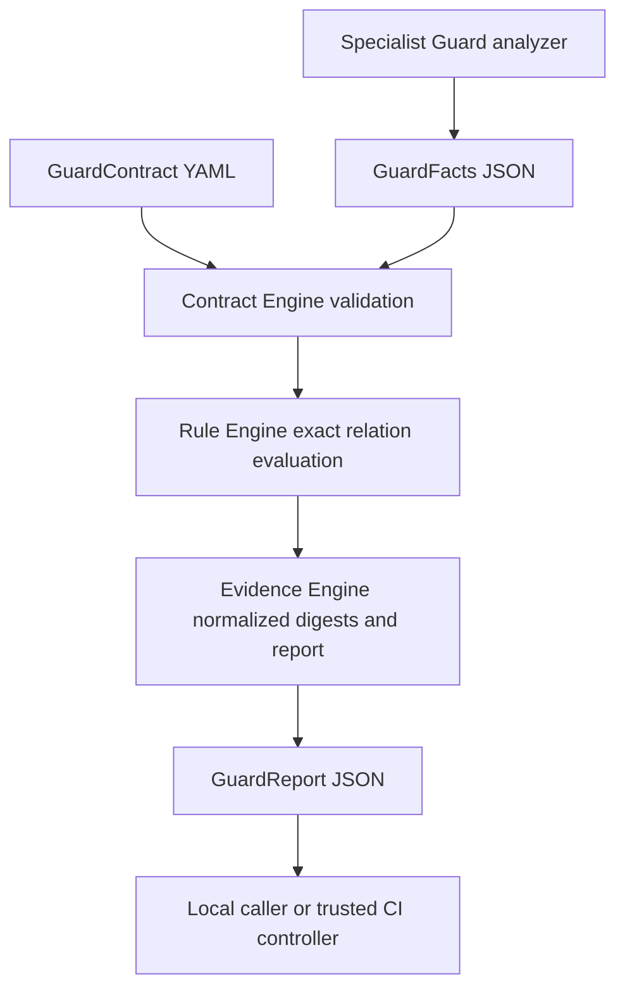

# GuardEngine architecture

Status: documentation baseline reviewed against main `0284f1ef4bb93e6602d5a65a5341f10e01a63ddf` on 2026-10-09. **Implemented** means visible in this source snapshot, not independently validated in this documentation session. **Target** sections describe future work. See [technical design](technical-design.md), [current wire protocol](protocol.md), [shared integration draft](integration-contract.md) and [security](security.md).

## 1. Purpose, scenarios and boundaries

GuardEngine is the domain-neutral evaluation layer beneath six independent Guards. It converts a supported protected contract and analyzer-provided facts into a deterministic report. A developer can evaluate local facts, CI can recompute a report, and a specialized Guard can embed the library without a daemon. A report explains why a rule allowed, blocked or required review; it cannot prove that inputs came from a trustworthy checkout.

The engine does not discover specifications, parse source code, run tests, operate Git, orchestrate workflow stages, issue approvals or decide whether architecture is good. Domain meaning belongs to the specialist that observes it. No central always-on service is required. The former core naming is retired in favor of GuardEngine; historical protocol identifiers remain unchanged for compatibility.

| Independent Guard | Owns | Engine integration status |
|---|---|---|
| SpecGuard | Requirements, acceptance criteria, traceability and approved specification baselines | Target; documentation-only repository at inspection |
| ArchGuard | Dependency extraction and architectural boundary policies | Current Cargo workspace analyzer, sibling path dependency |
| CodeGuard | Existing code analysis, hooks, native reports and runtime | Mature independent implementation; future gradual adapter |
| TestGuard | Test selection/results, coverage obligations and flaky-test evidence | Target; documentation-only repository at inspection |
| GitGuard | Git candidates, refs, merge queue and controlled mutation preconditions | Target; documentation-only repository at inspection |
| FlowGuard | Stage obligations, dependencies and approval orchestration | Target; documentation-only repository at inspection |

These statuses are source observations from the seven repositories, not a claim that the entire system integrates today. Independent release cadences and source ownership remain intact; CodeGuard must retain its working features during adoption.

## 2. Implemented structure and dependency direction



The three engines are logical responsibilities in one Rust crate, not separate deployed services or independently versioned crates.

| Source | Implemented responsibility | Boundary |
|---|---|---|
| `src/protocol.rs` | Serde models, version/kind checks, required values and unique rule IDs, YAML/JSON loading | No domain parsing or policy registry |
| `src/engine.rs` | Exact relation matching, aggregation, digests and full-report verification | No user code execution, identity checks or signatures |
| `src/analyzer.rs` | `GuardAnalyzer::analyze(&Path, &str)` contract | Analyzer implementation lives outside the engine |
| `src/error.rs` | `InvalidProtocol`, `Input`, `Serialization` errors | CLI also handles filesystem and argument errors |
| `src/lib.rs` | Public reexports | Synchronous library, no hidden execution service |
| `src/main.rs` | `evaluate` and `verify`, files/stdout/stderr, exit mapping | Manual argument parsing, no general job API |

Contract Engine validates both contract and facts before Rule Engine decisions. Evidence Engine computes over those validated inputs, retaining analyzer identity and subject scope. This division must survive future modularization; it is not permission to move stage rules or language grammars into the engine.

## 3. Domain model and input/output contract

The current domain is evaluation, not software architecture itself:

- `GuardContract`: exact API/kind, metadata `id` and `revision`, nonempty ordered rules. Each rule has unique ID, optional description, enforcement, and one `forbid_relation` assertion.
- `GuardFacts`: exact API/kind, analyzer ID/version, subject ID/snapshotDigest, completeness, facts and diagnostics. Partial input requires at least one diagnostic.
- `GuardFact`: subject, predicate, object, source. Relation coordinates are exact strings; source attributes evidence, not the matching condition.
- `GuardReport`: engine version, input digests, stable evaluation ID, copied analyzer/subject, ordered rule evaluations, decision, `signed: false`.
- `RuleEvaluation`: ID, status, enforcement, matched facts and detail. An advisory match is retained even though its status is PASS.

The [protocol document](protocol.md) defines existing JSON/YAML fields. The [integration draft](integration-contract.md) proposes a **separate** run envelope for candidate/task/baseline/approval binding. Adding its fields to current objects is an error. An engine subject snapshot can cover only manifests; it is not automatically a full Git-tree digest.

## 4. Evaluation lifecycle and decision algebra

```text
received -> contract validated -> facts validated -> facts normalized
         -> rules evaluated -> verdict aggregated -> report serialized/emitted
any validation/serialization/I/O failure -> caller error (no valid report guaranteed)
verify -> recompute -> exact report equality | mismatch error at CLI
```

There is no persisted workflow state or approval state machine in the current engine. Each call is pure evaluation of supplied data, apart from CLI file I/O. The proposed integration controller owns queued/running/completed/error/cancelled attempt state and eligibility invalidation.

| Facts / match | Rule status | Aggregate consequence |
|---|---|---|
| Partial, regardless of match or enforcement | INDETERMINATE | BLOCK |
| Complete, no exact match | PASS | No added restriction |
| Complete, enforce match | FAIL | BLOCK |
| Complete, review match | REVIEW_REQUIRED | REQUIRE_APPROVAL unless another rule blocks |
| Complete, advise match | PASS with matched facts and advisory detail | No added restriction |

Precedence: BLOCK > REQUIRE_APPROVAL > ALLOW. NOT_APPLICABLE exists in the enum but no current path emits it. REQUIRE_APPROVAL reports an unresolved review obligation; the engine has no method to authenticate an approval or transform it into authorization.

## 5. Evidence, reproducibility and audit

Implemented normalization sorts/deduplicates complete fact records, then hashes Serde JSON bytes. Rules retain contract order; diagnostic order also remains significant. `source` is part of a fact, so identical triples from different source strings remain distinct. Evaluation ID binds API version, engine package version, contract digest and facts digest. Verification compares the entire recomputed report, not merely supplied digests.

This is deterministic within the current Rust serialization model, not a published cross-language canonical-JSON standard. Untrusted callers can fabricate complete facts and recompute a perfectly consistent unsigned report. Trusted provenance requires independent analysis under protected policies plus authenticated candidate binding. The current engine stores neither events nor approvals nor wall-clock expiration.

Target audit storage keeps immutable input/report references and separately records producer identity, candidate/base, scope, baseline, policy and approval references, timestamps and invalidation causes. Avoid storing secrets or full source when digest/location suffices. Signing, key rotation, retention and evidence access control are integration work and remain unimplemented.

## 6. Baselines, approvals, concurrent requirements and merge queues

A baseline means different things in each domain; engine metadata revision is only a string and cannot establish authority. SpecGuard owns requirement-baseline meaning, ArchGuard boundary evolution, CodeGuard finding compatibility, TestGuard test obligations, GitGuard ref expectations and FlowGuard stage dependencies. A trusted controller freezes the approved baseline and policy digests before evaluating candidate inputs.

Target reuse is keyed by immutable repository/candidate/base/merge group, analyzed snapshot, contract, analyzer/version, coverage and task/requirement binding. Changing any relevant binding invalidates eligibility. Approval expiry or revocation invalidates authorization even if technical input digests match. An approval cannot make partial analysis complete. Parallel tasks must not share mutable latest-result slots; late results attach to their original candidate and cannot override a newer run.

For merge queues, rerun all required checks on the exact synthetic candidate with its base and group identity. A PR-head result is insufficient. GuardEngine returns the same deterministic mechanism for these facts; it does not fetch Git refs or enforce branch protection. The shared integration contract defines target controller behavior, not an existing feature of this crate.

## 7. Security and permissions

Library evaluation needs no network or command execution. The CLI reads explicitly supplied paths and may write `--report`; it is not a sandbox and currently does not enforce path containment, input byte limits or atomic output writes. Integrators must isolate untrusted worktrees, restrict filesystem access and bound resources. Analyzer subprocess permissions belong to each Guard, not this library.

Current strict field parsing prevents silent misspellings and unknown operators. It does not authenticate policies, validate digest syntax, constrain relation vocabulary, remove secrets or prevent a malicious analyzer claiming completeness. Protected CI must independently obtain approved policy and exact source, rerun the analyzer, record failures and enforce the required status. See [security](security.md) for threat assumptions.

## 8. Extension and release strategy

Keep generic extensibility narrow: capabilities, typed neutral operators, explicit schema evolution and golden vectors may become engine concerns. Domain grammars, workflow stages and approval-provider rules stay external. A future arbitrary expression engine would require a separate ADR, deterministic execution limits and threat review; it is not selected or available today.

Preserve `guard.partme.ai/v1alpha1` until a migration is explicitly designed. New package releases and policy revisions do not imply a new wire schema; breaking wire changes do. Current compatibility is exact version matching, not N/N-1 negotiation. ArchGuard presently embeds a sibling checkout; independent pinned releases and adapter compatibility matrices are future acceptance gates.

## 9. Design decisions and phased acceptance

| Decision | Rationale / consequence |
|---|---|
| Six independent Guards on one embedded engine | Domain teams evolve independently; no mandatory service |
| Strict versioned objects and exact operator | Reject ambiguity; richer policies require explicit evolution |
| Partial analysis blocks even advisory contracts | Unknown coverage cannot masquerade as success |
| Unsigned reproducible reports | Useful integrity checks without false claims of authority |
| Approval outside engine | Separates technical findings from authenticated permissions |
| CodeGuard migration through opt-in adapters | Protects mature native CLI/hooks/reports |

The [technical design](technical-design.md) gives measurable phases. Open decisions before implementation are cross-language canonicalization, capability negotiation, independent artifact distribution, approval/attestation providers, retention limits and the draft envelope schema. None prevents review of this documentation baseline.
